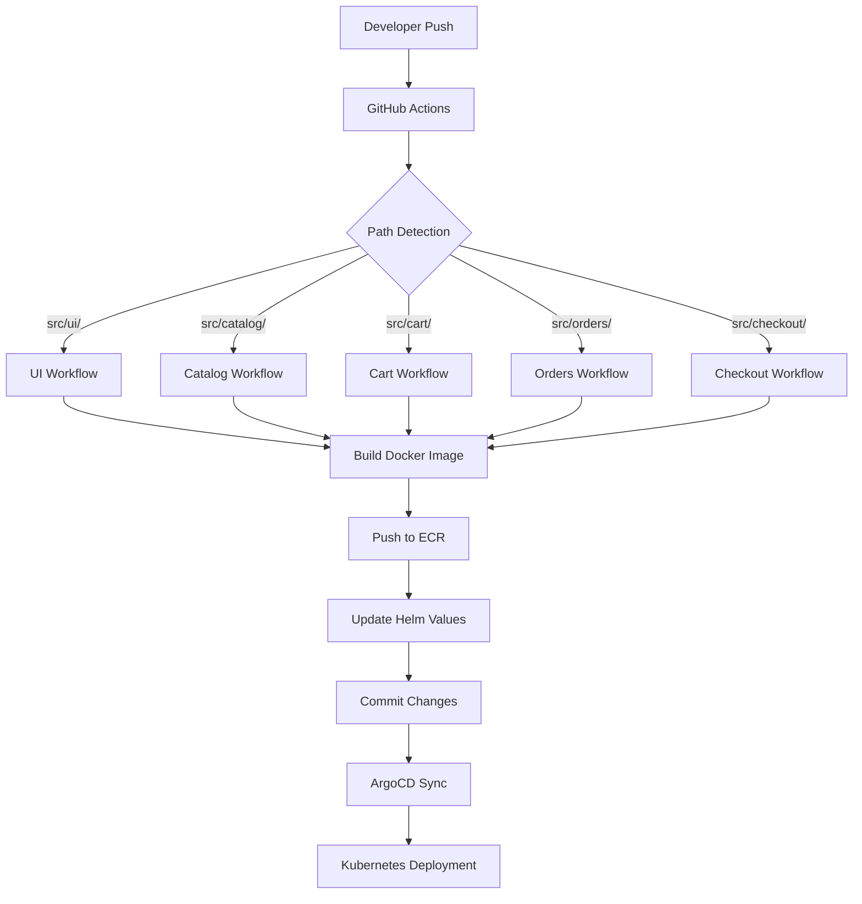
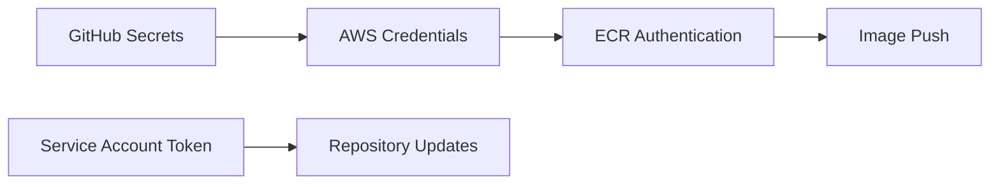

# Design Document

## Overview

This design implements a comprehensive CI/CD pipeline using GitHub Actions for the retail store sample application. The solution creates individual workflows for each microservice (ui, catalog, cart, orders, checkout) that automatically detect changes, build Docker images, push to Amazon ECR, and update Helm chart values for GitOps deployment.

The architecture follows modern DevOps practices with path-based change detection, secure credential management, and automated GitOps integration with ArgoCD.

## Architecture

### High-Level Architecture



### Workflow Trigger Strategy

The design uses GitHub Actions path filters to ensure only relevant services are built when changes occur:

- **Path-based triggers**: Each workflow monitors specific paths (`src/{service}/**`)
- **Concurrent execution**: Multiple services can be built simultaneously if changed
- **Efficient resource usage**: No unnecessary builds for unchanged services

### Security Architecture



## Components and Interfaces

### 1. Workflow Files Structure

```
.github/
└── workflows/
    ├── ci-ui.yml
    ├── ci-catalog.yml
    ├── ci-cart.yml
    ├── ci-orders.yml
    └── ci-checkout.yml
```

### 2. Service Configuration Matrix

| Service  | Language | Build Tool | Port | ECR Repository Pattern |
|----------|----------|------------|------|----------------------|
| UI       | Java     | Maven      | 8080 | {account}.dkr.ecr.{region}.amazonaws.com/retail-store-ui |
| Catalog  | Go       | Go Build   | 8080 | {account}.dkr.ecr.{region}.amazonaws.com/retail-store-catalog |
| Cart     | Java     | Maven      | 8080 | {account}.dkr.ecr.{region}.amazonaws.com/retail-store-cart |
| Orders   | Java     | Maven      | 8080 | {account}.dkr.ecr.{region}.amazonaws.com/retail-store-orders |
| Checkout | Node.js  | Yarn       | 8080 | {account}.dkr.ecr.{region}.amazonaws.com/retail-store-checkout |

### 3. Workflow Components

#### A. Change Detection Component
- **Trigger**: `push` events to `main` branch
- **Path Filters**: Service-specific path monitoring
- **Concurrency**: Prevents duplicate runs for same commit

#### B. Build Component
- **Docker Build**: Multi-stage builds using service Dockerfiles
- **Caching**: Docker layer caching for faster builds
- **Tagging Strategy**: Git commit SHA for traceability

#### C. ECR Integration Component
- **Authentication**: AWS CLI with temporary credentials
- **Repository Management**: Auto-creation of ECR repositories
- **Image Pushing**: Tagged images with metadata

#### D. Helm Update Component
- **Values Parsing**: YAML manipulation for image updates
- **Repository Updates**: Automated commits with new image tags
- **GitOps Integration**: Triggers ArgoCD sync through repository changes

## Data Models

### 1. Workflow Configuration Schema

```yaml
name: CI/CD - {Service Name}
on:
  push:
    branches: [main]
    paths: ['src/{service}/**']
  workflow_dispatch:

env:
  AWS_REGION: ${{ secrets.AWS_REGION }}
  ECR_REPOSITORY: retail-store-{service}
  SERVICE_NAME: {service}
```

### 2. Image Metadata Model

```json
{
  "service": "string",
  "commit_sha": "string",
  "build_timestamp": "ISO8601",
  "ecr_repository": "string",
  "image_tag": "string",
  "helm_chart_path": "string"
}
```

### 3. Helm Values Update Schema

```yaml
image:
  repository: "{account}.dkr.ecr.{region}.amazonaws.com/retail-store-{service}"
  tag: "{commit_sha}"
  pullPolicy: "Always"
```

## Error Handling

### 1. Build Failures
- **Docker Build Errors**: Detailed logging with build context
- **Dependency Issues**: Clear error messages for missing dependencies
- **Resource Constraints**: Appropriate runner sizing and timeout handling

### 2. ECR Integration Failures
- **Authentication Errors**: Clear AWS credential validation
- **Repository Access**: Automatic repository creation with proper permissions
- **Network Issues**: Retry logic for transient failures

### 3. Helm Update Failures
- **YAML Parsing Errors**: Validation before updates
- **Git Conflicts**: Conflict resolution strategies
- **Permission Issues**: Service account validation

### 4. Rollback Strategy
- **Failed Deployments**: Automatic rollback to previous image tags
- **Validation Checks**: Pre-deployment validation hooks
- **Manual Intervention**: Clear escalation paths for critical failures

## Testing Strategy

### 1. Workflow Testing
- **Unit Tests**: Individual workflow step validation
- **Integration Tests**: End-to-end pipeline testing
- **Security Tests**: Credential handling and permission validation

### 2. Build Testing
- **Docker Build Tests**: Validate Dockerfiles across all services
- **Multi-platform Builds**: Ensure compatibility across architectures
- **Performance Tests**: Build time optimization validation

### 3. Deployment Testing
- **Helm Chart Validation**: Template rendering and value substitution
- **Kubernetes Deployment**: Dry-run validation before actual deployment
- **Service Health Checks**: Post-deployment validation

### 4. Security Testing
- **Vulnerability Scanning**: Container image security scanning
- **Credential Validation**: Secure handling of AWS credentials
- **Access Control**: Proper IAM permissions and least privilege

### 5. Monitoring and Observability
- **Workflow Metrics**: Build times, success rates, failure patterns
- **ECR Metrics**: Image push/pull statistics
- **ArgoCD Integration**: Sync status and deployment health
- **Alerting**: Failure notifications and escalation procedures

## Implementation Considerations

### 1. Performance Optimization
- **Parallel Builds**: Concurrent service builds when multiple services change
- **Caching Strategy**: Docker layer caching and dependency caching
- **Resource Allocation**: Appropriate GitHub runner sizing

### 2. Security Best Practices
- **Credential Management**: GitHub Secrets for AWS credentials
- **Least Privilege**: Minimal IAM permissions for ECR access
- **Image Scanning**: Automated vulnerability scanning

### 3. GitOps Integration
- **Automated Sync**: ArgoCD automatic synchronization
- **Change Tracking**: Clear audit trail for deployments
- **Rollback Capability**: Easy reversion to previous versions

### 4. Scalability Considerations
- **Multi-environment Support**: Easy extension to staging/production
- **Service Addition**: Template-based approach for new services
- **Regional Deployment**: Multi-region ECR support